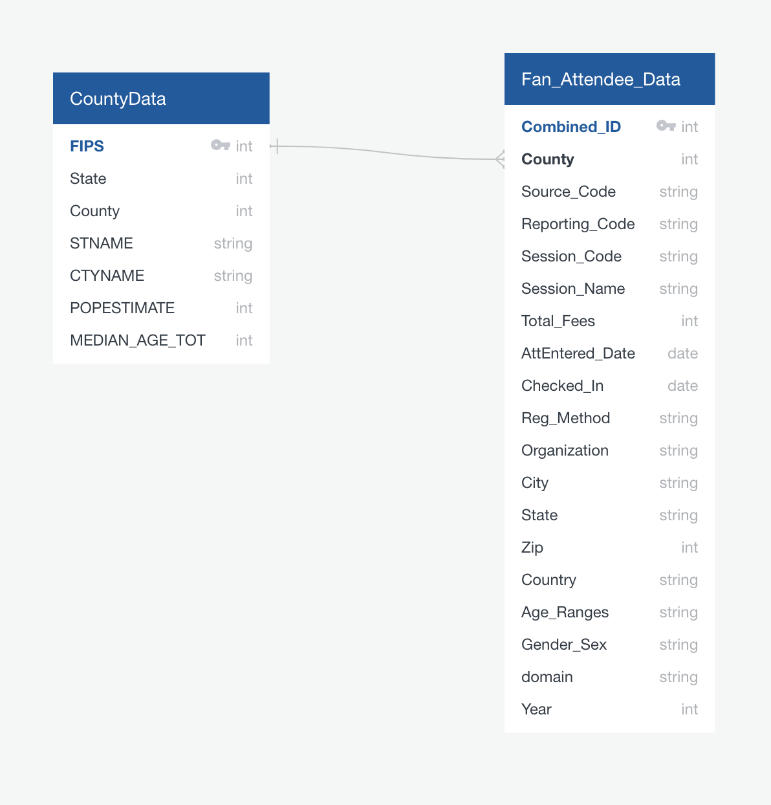

# FanimeCon Attendee Data Analysis 2018 - 2020
Classify and categorize demographics data from Attendees to the FanimeCon conferance from 2018 through 2020. Come up with conclusions of what types of attendees we have, and where it would be best to spend resources increasing our attendance.

## Resources
- CSV: Registration information from FanimeCon's Registration databases
- FIPS: County information for the United States, cataloged and organzied by me: https://github.com/Sukurudo/FIPS_County_Zip
- Software: PostgreSQL 11.7, pgAdmin 4, QuickDBD, Python, Pandas, Tableau

## ERD
## Entity Relationship Diagram

Using QUickDBD, I mapped out the single key that would link the two databases togther. One database, FIPS; contained county demographics such as name, state, and population data. The other database contained FanimeCon attendee data that was already processed to contain the county number based on the attendees postal code.

## Analysis of FanimeCon Attendee Data
http://fani.mobi/stats18-20
